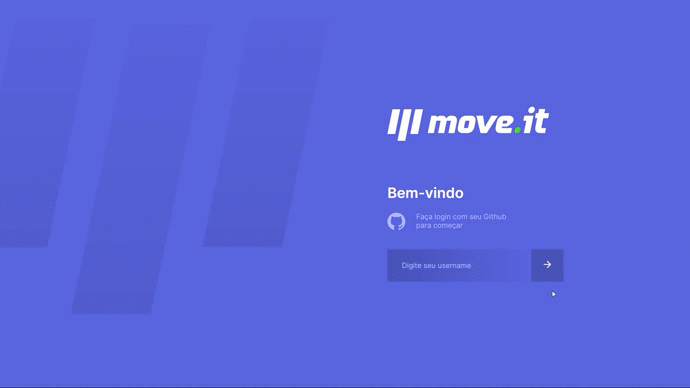
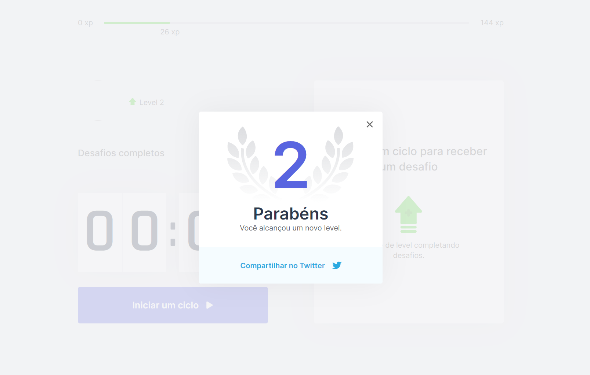

# 

  <center > </center>


## ⚡ Tecnologias

  Esse projeto foi desenvolvido com as seguintes tecnologias:

  - [React](https://reactjs.org/)
  - [Next.js](https://nextjs.org/)

## 💻 Projeto
  O projeto Moveit desenvolvido durante a NLW da Rocketseat, é uma aplicação com
	o objetivo de ajudar pessoas que passam muito tempo na frente do computador.
	A cada 25 minutos gera um desafio para cumprir seja ele para os olhos ou para
	o corpo, e a cada desafio feito você ganha experiência para subir de nível!

## 📁 Scripts

- Para instalar as dependências use esse comando:
```
yarn
```
(Caso não possua o yarn siga esta documentação de como instalar: https://classic.yarnpkg.com/en/docs/install/#windows-stable)

- Para iniciar o projeto no navegador utilize este comando:
```
yarn dev
```

## Tela de level up


<center > </center>
